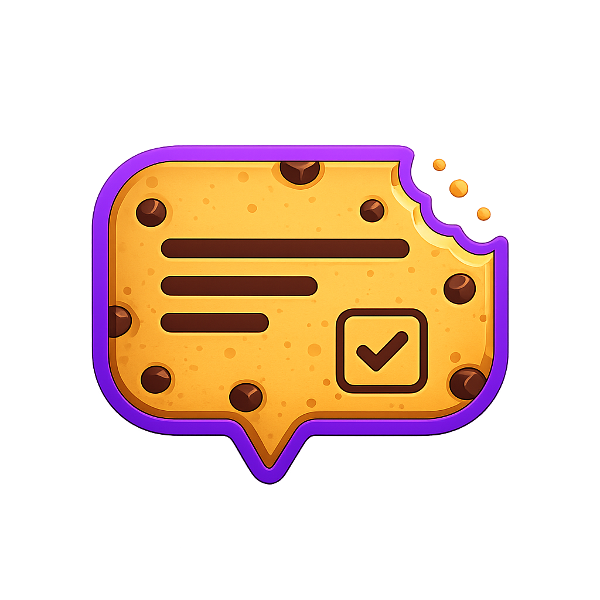

<div align="center">
  
  <h1>CookieDialog</h1>
  <p>A lightweight, accessible GDPR cookie consent dialog with built-in geolocation support. Zero dependencies, easy integration via CDN or NPM.</p>
</div>

[](https://www.npmjs.com/package/cookiedialog)
[](https://bundlephobia.com/package/cookiedialog)
[](https://opensource.org/licenses/MIT)

📚 **Full documentation, examples and framework guides:** [robododd.com/cookie-dialog](https://robododd.com/cookie-dialog/)

## Features

- 🚀 **Lightweight** - Around 6KB gzipped (JS + CSS), zero dependencies
- 📍 **Geolocation Detection** - Only show the dialog to visitors in the EU/EEA
- 💾 **Persistent Consent** - Stored in localStorage with configurable expiry
- ♿ **Accessible** - Dialog roles, labelled toggles, focus management, keyboard and Escape support
- 🎨 **Themeable** - Light, dark and auto themes, plus CSS custom properties for branding
- 🌍 **Translatable** - Every string can be replaced
- 📱 **Responsive** - Bottom banner, top banner or centered modal, all mobile-friendly

## Quick Start

### CDN

```html
<link rel="stylesheet" href="https://cdn.jsdelivr.net/npm/cookiedialog@1/dist/cookiedialog.min.css">
<script src="https://cdn.jsdelivr.net/npm/cookiedialog@1/dist/cookiedialog.min.js"></script>

<script>
  CookieDialog.init({
    enableLocation: true,
    privacyUrl: '/privacy',
    onAccept: (consent) => {
      if (consent.categories.analytics) {
        // load analytics
      }
    }
  });
</script>
```

### NPM

```bash
npm install cookiedialog
```

```javascript
import CookieDialog from 'cookiedialog';
import 'cookiedialog/dist/cookiedialog.min.css';

const dialog = CookieDialog.init({
  enableLocation: true,
  theme: 'auto',
  position: 'bottom'
});
```

## Configuration

| Option | Type | Default | Description |
|--------|------|---------|-------------|
| `enableLocation` | boolean | `false` | Only show the dialog to visitors in GDPR regions (IP based) |
| `autoShow` | boolean | `true` | Show the dialog automatically when consent is needed |
| `position` | string | `'bottom'` | `'bottom'`, `'top'` or `'center'` (modal with overlay) |
| `theme` | string | `'light'` | `'light'`, `'dark'` or `'auto'` (follows the OS setting) |
| `privacyUrl` | string | | Link to your privacy policy |
| `cookiePolicyUrl` | string | | Link to your cookie policy |
| `expiryDays` | number | `365` | Days before stored consent expires |
| `forceShow` | boolean | `false` | Show the dialog even when consent is already stored |
| `debug` | boolean | `false` | Log geolocation and lifecycle details to the console |
| `categories` | array | see below | Cookie categories shown in the preferences panel |
| `translations` | object | see below | Override any of the dialog's strings |
| `geolocationEndpoint` | string | | Custom endpoint returning `{ inEU, country, region }` |
| `onAccept` | function | | Visitor accepted all, or saved preferences with at least one optional category on |
| `onReject` | function | | Visitor rejected all, or saved preferences with every optional category off |
| `onChange` | function | | Visitor saved preferences from the panel (fires alongside `onAccept`/`onReject`) |
| `onLocationNotRequired` | function | | Geolocation determined consent is not required |

## API

```javascript
const dialog = CookieDialog.init(config);

dialog.show();                          // open the dialog (toggles reflect stored consent)
dialog.hide();                          // close without saving
dialog.destroy();                       // remove from the DOM

dialog.getConsent();                    // ConsentState | null
dialog.hasConsent();                    // boolean
dialog.getCategoryConsent('analytics'); // boolean
dialog.resetConsent();                  // clear stored consent
```

`getConsent()` returns:

```javascript
{
  timestamp: 1700000000000,
  categories: { necessary: true, analytics: false, marketing: false },
  version: '1.0.0',
  reason: 'user_accept' | 'user_reject' | 'location_not_required',
  locationData: { country: 'US', region: 'California', inEU: false, detectionMethod: 'ip_geolocation' } // when geolocation was used
}
```

Use `CookieDialog.create(config)` instead of `init` if you want to call `dialog.init()` yourself later.

### Re-opening the dialog

GDPR requires that withdrawing consent is as easy as giving it. Add a "Cookie settings" link to your footer:

```html
<a href="#" onclick="dialog.show(); return false;">Cookie settings</a>
```

## Categories

```javascript
CookieDialog.init({
  categories: [
    { id: 'necessary', name: 'Essential', description: 'Required for the site to work', required: true },
    { id: 'analytics', name: 'Analytics', description: 'Help us understand how the site is used', required: false },
    { id: 'marketing', name: 'Marketing', description: 'Used for personalised advertising', required: false }
  ]
});
```

Required categories show an "Always active" badge instead of a toggle. Optional categories start switched off.

## Translations

All strings can be overridden. Keys you leave out keep their English default.

```javascript
CookieDialog.init({
  translations: {
    title: 'We value your privacy',
    description: 'We use cookies to enhance your browsing experience and analyze our traffic.',
    acceptButton: 'Accept all',
    rejectButton: 'Reject all',
    settingsButton: 'Manage preferences',
    saveButton: 'Save preferences',
    privacyLink: 'Privacy Policy',
    cookiePolicyLink: 'Cookie Policy',
    necessaryCategory: 'Necessary',
    necessaryDescription: 'Essential cookies for the website to function properly',
    alwaysActive: 'Always active',
    settingsTitle: 'Cookie preferences'
  }
});
```

## Styling

The dialog is styled with CSS custom properties. Override them on `.cookie-dialog` (or `:root`) to match your brand:

```css
.cookie-dialog {
  --cd-accent: #e0245e;
  --cd-accent-hover: #b81b4c;
  --cd-accent-text: #fff;
  --cd-bg: #fff;
  --cd-text: #111;
  --cd-text-muted: #555;
  --cd-border: #e5e5e5;
  --cd-radius: 12px;
  --cd-button-radius: 8px;
  --cd-font-family: inherit;
  --cd-max-width: 1100px;
}
```

Other variables: `--cd-accent-soft`, `--cd-toggle-off`, `--cd-badge-bg`, `--cd-shadow`, `--cd-overlay`, `--cd-focus-ring`, `--cd-font-size`, `--cd-duration`. The dark palette is applied via `.cookie-dialog.theme-dark`, and `theme: 'auto'` switches with `prefers-color-scheme`. Animations respect `prefers-reduced-motion`.

For deeper changes target the `.cookie-dialog-*` classes directly.

## Geolocation

With `enableLocation: true` the dialog checks the visitor's IP. Visitors outside the EU/EEA are treated as consented to everything and the dialog is not shown. If the lookup fails, the dialog is shown.

```javascript
CookieDialog.init({
  enableLocation: true,
  geolocationEndpoint: 'https://your-api.com/location', // optional, must return { inEU, country?, region? }
  onLocationNotRequired: (location) => console.log('No consent needed for', location.country),
  onAccept: (consent) => {
    if (consent.reason === 'location_not_required') {
      // auto-accepted by location
    }
  }
});
```

## Browser Support

Chrome/Edge 88+, Firefox 78+, Safari 14+.

## Development

```bash
npm install
npm run dev      # watch build
npm run build    # production build to dist/
npm test
npm run demo     # opens the demo page at http://localhost:3000 (build first)
```

## License

MIT - see [LICENSE](LICENSE).

## Support

Issues and feature requests: [github.com/timothydodd/cookiedialog/issues](https://github.com/timothydodd/cookiedialog/issues)
